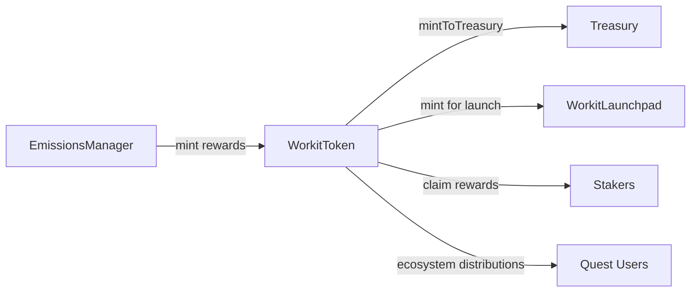
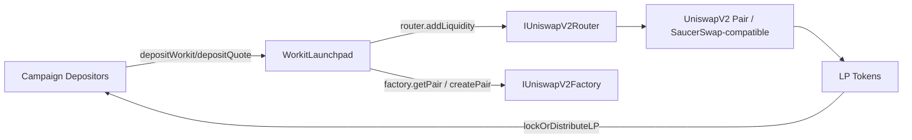
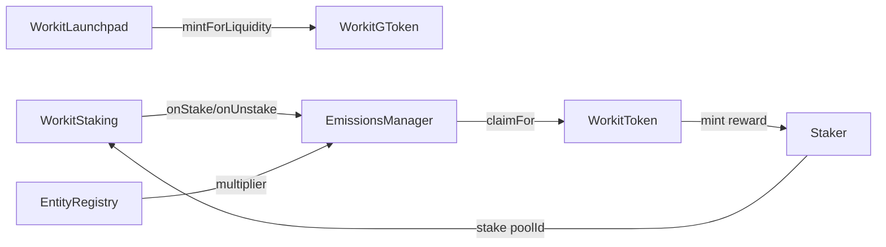

# WorkIt Tokenomics Architecture

This document describes the WorkIt Proof-of-Activity economic layer implemented in `libs/contracts/contracts/workit`.

## Modules

- `WorkitToken`: native ERC20 token (`WorkIt`, `WORKIT`) with role-based minting, treasury controls, and EIP-2612 permit.
- `WorkitLaunchpad`: liquidity bootstrap contract for WORKIT + quote asset campaigns.
- `WorkitGToken`: ERC1155 liquidity-receipt token where each pool maps to a deterministic token ID.
- `WorkitStaking`: pool-based GToken staking.
- `EmissionsManager`: epoch-based emission accounting per pool.
- `WorkitGovernance`: proposal / vote / execute governance.
- `EntityRegistry`: entity score, activity, and reward multipliers.

## Contract Layout

- `libs/contracts/contracts/workit/WorkitToken.sol`
- `libs/contracts/contracts/workit/WorkitLaunchpad.sol`
- `libs/contracts/contracts/workit/WorkitGToken.sol`
- `libs/contracts/contracts/workit/WorkitStaking.sol`
- `libs/contracts/contracts/workit/EmissionsManager.sol`
- `libs/contracts/contracts/workit/WorkitGovernance.sol`
- `libs/contracts/contracts/workit/EntityRegistry.sol`

## Token Flow

## Liquidity Flow

## Reward Flow

## GToken ID Derivation

Pool token IDs are deterministic and chain-aware:

- `tokenId = uint256(keccak256(abi.encode(poolAddress, chainId, campaignId)))`

This allows one ERC1155 ID per liquidity pool context.

## Governance Controls

`WorkitGovernance` can execute parameter changes on managed contracts, including:

- emissions rates (`EmissionsManager.configurePool`)
- launchpad and distribution policy updates
- future pool onboarding rules

Governance voting source is configurable:

- `ERC20_BALANCE` mode (WORKIT)
- `EXTERNAL_SOURCE` mode (e.g., GToken-weight adapter)

## Test Coverage

Tests are in:

- `libs/contracts/test/workit/workit-tokenomics.test.ts`

Scenarios included:

1. launchpad campaign and liquidity creation
2. GToken minting from launch finalization
3. staking + epoch emissions + entity multiplier
4. governance proposal, vote, execute
5. end-to-end tokenomics flow
